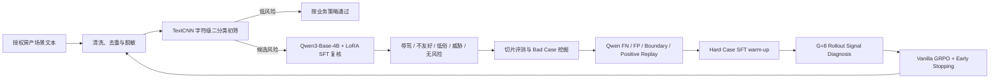
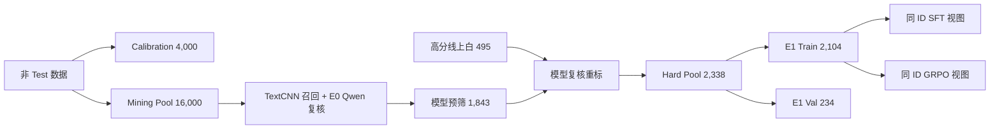

# 存量标签效果优化：TextCNN 初筛 + Qwen3 SFT / GRPO 后训练

面向线上语料分布变化以及房产沟通场景中“辱骂 / 不友好”标签的长尾漏检，本项目通过 TextCNN 高吞吐初筛、Qwen3-Base-4B + LoRA SFT 语义复核、Hard Case Mining 和 GRPO 后训练，持续修正模型对隐性攻击、低俗表达和威胁语义的识别边界。

> 本目录是公开安全版。真实聊天文本、审核日志、账号标识、内部接口、训练文件、词表、模型权重和压缩包均未上传；示例全部为合成内容。

## 1. 任务背景

存量标签不是“一次训练、永久有效”。线上表达持续变化，房产经纪人、业主和用户之间的短句对话还具有省略多、口语化强、上下文短等特点，容易出现：

- 直接辱骂容易识别，但反讽、贬损和伦理羞辱等隐性攻击漏检；
- 同一词语在正常沟通和人身攻击中的含义不同，纯关键词规则误伤高；
- 全量调用大模型成本高、时延大，无法替代低成本前置模型；
- 训练分布与新流量漂移后，原有阈值和样本边界逐渐失效。

## 2. 解决方案



### TextCNN 前置初筛

- 使用字符级切分，降低分词误差并增强对口语、错别字和变体表达的适应性；
- 采用 3/4/5 字卷积窗口并行提取局部 n-gram 信号；
- 以低成本、高吞吐方式覆盖全量文本，优先保证风险候选召回；
- 对长文本分段推理并取最高风险分，避免局部风险被正常上下文稀释。

### Qwen3 大模型复核

- 使用 Qwen3-Base-4B + LoRA SFT 学习细粒度语义边界；
- 将候选内容细分为辱骂、不友好、低俗、威胁恐吓和无风险；
- 利用大模型区分字面相似但意图不同的正常沟通与人身攻击；
- 仅处理前置模型路由出的候选，平衡效果、时延和推理成本。

### Bad Case 闭环

1. 按时间和业务切片执行回归；
2. 分别提取漏检与误伤样本；
3. 对隐性攻击、变体表达、上下文依赖和边界负例归因；
4. 去重、脱敏并按难例类型定向回流；
5. 重新训练后复测总体指标和关键切片。

### 为什么增加 GRPO

SFT 优化 reference response 的 token likelihood，但业务目标是“在可接受误伤下尽可能提高 Risk Recall”。本项目因此尝试使用可验证的二值 sequence-level reward 继续优化 Qwen：

```text
Risk = {辱骂, 不友好, 低俗, 威胁恐吓}
Safe = {无风险}

二值预测正确     +1
二值预测错误/非法 -1
```

风险子标签互相预测不扣分；例如 GT=低俗、模型输出=辱骂，业务上仍是 Risk→Risk。选择 GRPO 的原因包括：同一 prompt 的多个 rollout 可进行组内相对优化、不需要额外 critic，且 LoRA 训练可在 2×RTX 4090 上完成。

但短标签分类存在 zero-variance group：若同一 prompt 的 8 个回答全对或全错，组内 reward 没有差异，Vanilla GRPO 几乎得不到方向。因此没有直接套框架训练，而是先进行 rollout 信号诊断。

完整设计、数据血缘、配置、负向消融与限制见 [GRPO_EXPERIMENT.md](GRPO_EXPERIMENT.md)。

## 3. 数据规模

### TextCNN 数据

| 数据集 | 风险 `NEG` | 正常 `POS` | 合计 |
| --- | ---: | ---: | ---: |
| Train | 49,072 | 49,072 | 98,144 |
| Validation | 1,500 | 1,500 | 3,000 |
| Test | 1,500 | 1,500 | 3,000 |

### Qwen3 SFT 数据

| 标签 | 数量 |
| --- | ---: |
| 无风险 | 16,352 |
| 辱骂 | 6,059 |
| 不友好 | 1,158 |
| 低俗 | 630 |
| 威胁恐吓 | 333 |
| **合计** | **24,532** |

项目迭代总结记录了 2,472 条线上难例的定位与回流；当前提供目录未包含可逐条复核的完整难例台账，因此该数字作为项目记录口径展示，不随公开仓库分发。

## 4. 数据构建流程

1. 从获得授权的线上样本、举报标注和回归结果中抽取候选；
2. 统一二分类标签、风险细分类标签和空值处理规则；
3. 清理接口响应、无效内容、重复文本和明显脏数据；
4. 对手机号、邮箱、账号、长数字标识和内部链接进行脱敏；
5. 对易混入黑样本的白样本执行模型辅助复核；
6. 按标签分层构建 Train/Validation/Test，并检查集合交集；
7. 生成 TextCNN 二分类数据和 Qwen3 多标签 SFT 数据；
8. 运行离线回归并输出召回、误伤、混淆矩阵和切片指标；
9. 挖掘 false negative / false positive，完成归因后定向回流。

## 5. GRPO 数据闭环

所有后训练集合均排除 sealed Test、原 Qwen SFT 的精确归一化文本，并保证 Calibration 与 Hard Pool 互斥。旧标签只用于预筛，后续实验直接采用模型复核银标，无人工复核。



| Hard Pool bucket | 定义 | Pool | Train | Val |
| --- | --- | ---: | ---: | ---: |
| Qwen FN | GT Risk / TextCNN Risk / Qwen Safe | 716 | 644 | 72 |
| Qwen FP | GT Safe / TextCNN Risk / Qwen Risk | 103 | 93 | 10 |
| Boundary Replay | GT Safe / TextCNN Risk / Qwen Safe | 781 | 703 | 78 |
| Positive Replay | GT Risk / TextCNN Risk / Qwen Risk | 738 | 664 | 74 |
| **合计** |  | **2,338** | **2,104** | **234** |

第一版不按“低俗/不友好”过采样，也不人为重配四桶比例。E1 SFT 和 GRPO 使用完全相同的 2,104 个 sample IDs，从而将 E1→GRPO 的变化主要归因于训练算法，而不是新增数据。

## 6. GRPO 实验闭环

| 阶段 | 核心问题 | 结论 |
| --- | --- | --- |
| E0 Original SFT | 后置 Qwen 是否为瓶颈，能否直接 GRPO？ | Qwen conditional Recall 80.82%；T=0.9 ZVR 91.17%，不准入 |
| E1 Hard Case SFT | 相同难例再 SFT 能提升多少，能否打开探索空间？ | Test Recall 87.77%；ZVR 降至 51.17%，GRPO 准入 |
| E2 Vanilla GRPO | 不增加数据时，policy optimization 是否有独立收益？ | 有小幅正收益；需要 early stopping |
| E2.5 Early Sweep | 是否应该训练到最后？ | 否；独立 Calibration 约束选点更可靠 |
| E3 Hard-FN weighting | 放大历史 FN advantage 是否更好？ | 未超过 matched control，不采用 |
| E4 Dynamic Sampling | 过滤 zero-advantage group 是否节省 rollout？ | UER 上升但 generation EGR 未提升，不采用 |

E0 在 600 个压力测试 prompts 上执行 G=8 rollout：T=0.9 时 All-wrong 57.00%、Mixed 8.83%、ZVR 91.17%。E1 SFT 后，在相同 prompts 上 All-wrong 降至 5.00%、Mixed 升至 48.83%、ZVR 降至 51.17%。这说明 Hard Case SFT 的作用不仅是提高准确率，还把“完全不会”的 prompt 推入“有时对、有时错”的可优化区域。

Vanilla GRPO 的冻结配置：E1 同时作为 policy initialization 与 frozen reference；只训练新增 zero-init E2 LoRA；G=8、temperature=0.9、LR=1e-6、KL beta=0.01、clip=0.2、BF16、1 epoch。第一版不加入 cost-sensitive reward、risk subtype weighting、structured CoT 或 Dynamic Sampling，以隔离最基础的 GRPO 贡献。

## 7. 后训练实验结果

后续实验使用 6,510 条平衡、银标 sealed Test（Risk/Safe 各 3,255）。TextCNN 与阈值 0.5 全程冻结：

| 模型 | Pipeline Recall | FPR | Precision | F1 | MCC | Qwen-induced FN |
| --- | ---: | ---: | ---: | ---: | ---: | ---: |
| E0 Original SFT | 76.50% | 4.70% | 94.21% | 84.44% | 0.731 | 591 |
| E1 Hard Case SFT | 87.77% | 5.78% | 93.83% | 90.70% | 0.822 | 224 |
| **Final Vanilla GRPO step 448** | **88.60%** | **6.05%** | **93.61%** | **91.04%** | **0.827** | **197** |

增益必须拆开表述：

- E0→E1：Hard Case 数据与监督适配贡献 Recall +11.27pp；
- E1→Final：GRPO 独立贡献 Recall +0.83pp，Qwen-induced FN 224→197（减少 12.1%）；
- E0→Final：完整后训练贡献 Recall +12.10pp、F1 +6.60pp。

最终 checkpoint 仅由 4,000 条 Calibration 按 FPR guardrail 约束优先选择，Test 不参与训练或选模。E3/E4 的失败结果同样保留，因为 matched control 表明更复杂的加权和重采样没有产生独立收益。

> 该 sealed Test 是后续研究用的平衡银标集，与下文实习期间 1,533 黑 + 1,000 白的离线切片不是同一数据集，两个结果不可直接拼接比较。

## 8. 遇到的问题与解决方式

| 问题 | 表现 | 解决方案 |
| --- | --- | --- |
| 线上分布漂移 | 原线上模型对新表达召回不足 | 按时间切片挖掘漏检，定向补充隐性攻击和变体样本 |
| 正常语句与攻击词面重叠 | 关键词方案容易误伤 | 由大模型结合对象、语气和上下文复核语义意图 |
| 白样本夹杂风险内容 | 训练标签污染、误导决策边界 | 对白样本二次筛查，并由规则或人工复核高风险候选 |
| 类别与边界不均衡 | 直接辱骂多，威胁和隐性攻击少 | 分标签统计、分层采样，并优先回流长尾难例 |
| 长文本局部命中被稀释 | 全文平均分降低召回 | 分段推理，对各段风险概率取最大值 |
| 预处理训推不一致 | 离线与线上效果偏移 | 固化字符切分、截断、词表和标准化规则并加入回归测试 |
| 分类 rollout 方差不足 | E0 ZVR 91.17%，多数 group 无有效 advantage | 先做 Hard Case SFT，再执行配对 rollout 准入 |
| 训练 reward 上升但独立集不一定提升 | 后段策略边界持续偏 Risk | Calibration constraint-first + early stopping |
| 定向 FN 加权可能只是随机波动 | 跨 run GRPO 非 bitwise deterministic | 每项算法实验增加同批 matched control |
| Dynamic Sampling 指标虚高 | UER 上升但已丢弃 rollout 仍消耗算力 | 同时报告 generation-level EGR 与 compute/performance matched |

## 9. 实习阶段原始效果

独立离线评测使用 1,533 条黑样本和 1,000 条线上随机白样本：

| 版本 | 召回率 | 误伤率 |
| --- | ---: | ---: |
| 线上基线 | 72.7% | 0% |
| 优化后离线回归 | **87.3%** | **0.2%** |

召回率提升 14.6 个百分点，同时将白样本误伤控制在 0.2%。指标只代表对应离线切片，不承诺跨场景直接复现。

## 10. 公开脚本

- `scripts/sanitize_and_split.py`：对授权 TSV 执行基础 PII 脱敏、去重和分层切分；
- `scripts/mine_badcases.py`：从预测 JSONL 中提取漏检和误伤并输出脱敏难例；
- `scripts/evaluate_cascade.py`：复现“TextCNN 阈值路由 → 大模型复核”的级联指标；
- `scripts/prepare_post_training_views.py`：从 Hard Pool 生成同 ID 的 SFT 与 RL 数据视图；
- `scripts/grpo_reward.py`：实现业务二值 reward 和 G=8 rollout ZVR/Mixed 诊断；
- `scripts/train_grpo.py`：公开安全版的 E1 frozen reference + E2 trainable LoRA GRPO 入口；
- `tests/test_pipeline.py`：使用合成数据验证脱敏、切分、难例挖掘和级联评测。

## 11. 快速开始

脚本仅依赖 Python 标准库：

```bash
python scripts/sanitize_and_split.py \
  examples/synthetic_labeled.tsv \
  --train-output outputs/train.jsonl \
  --valid-output outputs/valid.jsonl \
  --valid-rate 0.25 \
  --seed 42

python scripts/evaluate_cascade.py examples/synthetic_predictions.jsonl --threshold 0.60

python scripts/mine_badcases.py \
  examples/synthetic_predictions.jsonl \
  --output outputs/badcases.jsonl

python -m unittest discover -s tests -v
```

生成同 ID SFT / RL 视图并检查 rollout 信号：

```bash
python scripts/prepare_post_training_views.py \
  examples/synthetic_hard_pool.jsonl \
  --output-dir outputs/post_training \
  --valid-rate 0.25 --seed 42

python scripts/grpo_reward.py examples/synthetic_rollouts.jsonl --group-size 8
```

真实 GRPO 训练依赖 PyTorch、Transformers、PEFT、Datasets、Accelerate 和 TRL；示例命令与版本边界见 [GRPO_EXPERIMENT.md](GRPO_EXPERIMENT.md)。

## 12. 限制

- 合成样本只能用于验证流程，不能用于训练生产模型；
- TextCNN 阈值必须基于目标流量重新标定；
- 应同时观察召回、误伤、大模型路由率、P95 时延和单条成本；
- 真实审核内容可能包含个人信息和有害表达，必须在授权环境中处理；
- 当前公开包不包含模型实现和权重，重点是可审计的数据闭环方法。
- 后训练 GT 与评测 GT 均为模型复核银标，无人工复核；结果衡量的是对该 verifier 判定边界的一致性；
- sealed Test 为 1:1 平衡集，Recall/FPR 可用于版本横向比较，其 Precision 不能直接外推线上自然分布；
- GRPO 的 +0.83pp 是相对 E1 Hard Case SFT 的独立增益，不能把 E0→E1 的 +11.27pp 归因给 RL。
