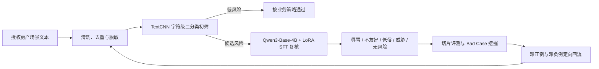

# 存量标签效果优化：TextCNN 初筛 + Qwen3 大模型复核

面向线上语料分布变化以及房产沟通场景中“辱骂 / 不友好”标签的长尾漏检，本项目通过 TextCNN 高吞吐初筛、Qwen3-Base-4B + LoRA SFT 语义复核和 Bad Case 定向回流，持续修正模型对隐性攻击、低俗表达和威胁语义的识别边界。

> 本目录是公开安全版。真实聊天文本、审核日志、账号标识、内部接口、训练文件、词表、模型权重和压缩包均未上传；示例全部为合成内容。

## 1. 任务背景

存量标签不是“一次训练、永久有效”。线上表达持续变化，房产经纪人、业主和用户之间的短句对话还具有省略多、口语化强、上下文短等特点，容易出现：

- 直接辱骂容易识别，但反讽、贬损和伦理羞辱等隐性攻击漏检；
- 同一词语在正常沟通和人身攻击中的含义不同，纯关键词规则误伤高；
- 全量调用大模型成本高、时延大，无法替代低成本前置模型；
- 训练分布与新流量漂移后，原有阈值和样本边界逐渐失效。

## 2. 解决方案



### TextCNN 前置初筛

- 使用字符级切分，降低分词误差并增强对口语、错别字和变体表达的适应性；
- 采用 3/4/5 字卷积窗口并行提取局部 n-gram 信号；
- 以低成本、高吞吐方式覆盖全量文本，优先保证风险候选召回；
- 对长文本分段推理并取最高风险分，避免局部风险被正常上下文稀释。

### Qwen3 大模型复核

- 使用 Qwen3-Base-4B + LoRA SFT 学习细粒度语义边界；
- 将候选内容细分为辱骂、不友好、低俗、威胁恐吓和无风险；
- 利用大模型区分字面相似但意图不同的正常沟通与人身攻击；
- 仅处理前置模型路由出的候选，平衡效果、时延和推理成本。

### Bad Case 闭环

1. 按时间和业务切片执行回归；
2. 分别提取漏检与误伤样本；
3. 对隐性攻击、变体表达、上下文依赖和边界负例归因；
4. 去重、脱敏并按难例类型定向回流；
5. 重新训练后复测总体指标和关键切片。

## 3. 数据规模

### TextCNN 数据

| 数据集 | 风险 `NEG` | 正常 `POS` | 合计 |
| --- | ---: | ---: | ---: |
| Train | 49,072 | 49,072 | 98,144 |
| Validation | 1,500 | 1,500 | 3,000 |
| Test | 1,500 | 1,500 | 3,000 |

### Qwen3 SFT 数据

| 标签 | 数量 |
| --- | ---: |
| 无风险 | 16,352 |
| 辱骂 | 6,059 |
| 不友好 | 1,158 |
| 低俗 | 630 |
| 威胁恐吓 | 333 |
| **合计** | **24,532** |

项目迭代总结记录了 2,472 条线上难例的定位与回流；当前提供目录未包含可逐条复核的完整难例台账，因此该数字作为项目记录口径展示，不随公开仓库分发。

## 4. 数据构建流程

1. 从获得授权的线上样本、举报标注和回归结果中抽取候选；
2. 统一二分类标签、风险细分类标签和空值处理规则；
3. 清理接口响应、无效内容、重复文本和明显脏数据；
4. 对手机号、邮箱、账号、长数字标识和内部链接进行脱敏；
5. 对易混入黑样本的白样本执行模型辅助复核；
6. 按标签分层构建 Train/Validation/Test，并检查集合交集；
7. 生成 TextCNN 二分类数据和 Qwen3 多标签 SFT 数据；
8. 运行离线回归并输出召回、误伤、混淆矩阵和切片指标；
9. 挖掘 false negative / false positive，完成归因后定向回流。

## 5. 遇到的问题与解决方式

| 问题 | 表现 | 解决方案 |
| --- | --- | --- |
| 线上分布漂移 | 原线上模型对新表达召回不足 | 按时间切片挖掘漏检，定向补充隐性攻击和变体样本 |
| 正常语句与攻击词面重叠 | 关键词方案容易误伤 | 由大模型结合对象、语气和上下文复核语义意图 |
| 白样本夹杂风险内容 | 训练标签污染、误导决策边界 | 对白样本二次筛查，并由规则或人工复核高风险候选 |
| 类别与边界不均衡 | 直接辱骂多，威胁和隐性攻击少 | 分标签统计、分层采样，并优先回流长尾难例 |
| 长文本局部命中被稀释 | 全文平均分降低召回 | 分段推理，对各段风险概率取最大值 |
| 预处理训推不一致 | 离线与线上效果偏移 | 固化字符切分、截断、词表和标准化规则并加入回归测试 |

## 6. 效果

独立离线评测使用 1,533 条黑样本和 1,000 条线上随机白样本：

| 版本 | 召回率 | 误伤率 |
| --- | ---: | ---: |
| 线上基线 | 72.7% | 0% |
| 优化后离线回归 | **87.3%** | **0.2%** |

召回率提升 14.6 个百分点，同时将白样本误伤控制在 0.2%。指标只代表对应离线切片，不承诺跨场景直接复现。

## 7. 公开脚本

- `scripts/sanitize_and_split.py`：对授权 TSV 执行基础 PII 脱敏、去重和分层切分；
- `scripts/mine_badcases.py`：从预测 JSONL 中提取漏检和误伤并输出脱敏难例；
- `scripts/evaluate_cascade.py`：复现“TextCNN 阈值路由 → 大模型复核”的级联指标；
- `tests/test_pipeline.py`：使用合成数据验证脱敏、切分、难例挖掘和级联评测。

## 8. 快速开始

脚本仅依赖 Python 标准库：

```bash
python scripts/sanitize_and_split.py \
  examples/synthetic_labeled.tsv \
  --train-output outputs/train.jsonl \
  --valid-output outputs/valid.jsonl \
  --valid-rate 0.25 \
  --seed 42

python scripts/evaluate_cascade.py examples/synthetic_predictions.jsonl --threshold 0.60

python scripts/mine_badcases.py \
  examples/synthetic_predictions.jsonl \
  --output outputs/badcases.jsonl

python -m unittest discover -s tests -v
```

## 9. 限制

- 合成样本只能用于验证流程，不能用于训练生产模型；
- TextCNN 阈值必须基于目标流量重新标定；
- 应同时观察召回、误伤、大模型路由率、P95 时延和单条成本；
- 真实审核内容可能包含个人信息和有害表达，必须在授权环境中处理；
- 当前公开包不包含模型实现和权重，重点是可审计的数据闭环方法。
