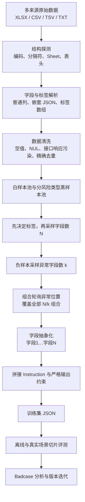

# L1 字段自适应内容审核微调数据集

面向多业务、多字段内容审核场景构建的二分类监督微调（SFT）数据集与数据工程方案。项目以 Qwen3-Base-4B 为基础模型，通过字段抽象、分布控制、异常位置轮询和真实场景切片评测，使模型学习“逐字段审核、任一字段违规即整条不通过”的稳定判定逻辑。

> 数据治理说明：原始样本来源于真实审核业务，可能包含个人信息、联系方式、敏感文本和内部字段。公开仓库应只包含构建脚本、统计信息、数据卡与脱敏示例；原始样本和完整训练集需要在完成授权、隐私审查与许可证确认后，通过受控存储分发。

## 1. 项目概览

| 项目 | 内容 |
| --- | --- |
| 任务类型 | 多字段内容审核二分类 |
| 基础模型 | Qwen3-Base-4B |
| 输入 | 1～8 个数量不固定、名称不固定的文本字段 |
| 输出 | `是`（全部字段合规）或 `否`（任一字段违规） |
| 聚合逻辑 | 逐字段独立判断后进行 OR 聚合 |
| v1 规模 | 50,000 条，黑白样本各 25,000 条 |
| v4 规模 | 100,000 条，黑白样本各 50,000 条 |
| 最终格式 | JSON 数组，字段为 `id`、`instruction`、`input`、`output`、`task_type` |
| 主要风险类型 | 色情与低俗、政治敏感与分裂、暴恐；后续版本扩展到管制器具、网络水军、赌博、毒品、邪教等 |

## 2. 任务背景：要解决什么问题

传统审核模型通常假定输入字段固定，例如只审核 `title` 或 `content`。真实业务中，不同场景的字段结构差异明显：

- 字段数量可能从 1 个变化到 8 个以上；
- 字段名称、顺序和业务语义不统一；
- 违规内容可能出现在任意字段，也可能同时出现在多个字段；
- 模型容易把字段名称或字段位置当成捷径，而没有真正理解内容；
- 若直接将所有字段拼成一段文本，模型可能忽略靠后的风险字段；
- 下游系统只接受稳定的 `是/否` 输出，解释性文本会导致解析失败。

因此，本项目不只是在做“违规文本分类”，而是在解决四类结构泛化问题：

| 不变性 | 目标 |
| --- | --- |
| 字段数量不变性 | 1 个字段和 8 个字段遵循同一判定逻辑 |
| 位置不变性 | 风险出现在首字段、末字段或中间字段都应判违规 |
| 多异常不变性 | 一个字段违规和多个字段违规都应输出 `否` |
| 字段名称不变性 | 不依赖 `title`、`content` 等业务字段名，只判断内容 |

最终任务定义为：

```text
任一字段违规 → 整条样本输出“否”
所有字段合规 → 整条样本输出“是”
```

## 3. 总体解决方案



关键设计不是“随机混合文本”，而是先确定标签和结构，再按受控分布生成样本，避免字段数量、位置和类别比例产生不可控偏置。

## 4. 原始数据处理

### 4.1 数据来源与形态

原始样本来自多个审核场景和离线样本池，格式包括：

- 多 Sheet Excel；
- UTF-8、UTF-8-BOM、GB18030 编码的 CSV/TSV；
- 单字段 TXT 样本池；
- 普通字符串、嵌套 JSON 字符串和 JSON 数组标签；
- 字段名和标签名不统一的场景化审核日志。

### 4.2 前置探测

每个新数据源先执行固定检查：

1. 文件大小和有效行数；
2. 编码探测，优先 UTF-8-SIG，失败时回退 GB18030；
3. 分隔符探测，区分逗号与制表符；
4. Sheet、表头和前几条原文检查；
5. 标签字段或审核原因字段的频次统计；
6. 目标字段存在率与空值率检查。

### 4.3 清洗规则

- 去除首尾空白和空行；
- 将空字符串、`null`、`None`、`NaN`、`na`、`n/a` 等统一视为空值；
- 读取 CSV 前流式过滤 `\x00` NUL 字节；
- 删除 `chat.completion`、`completion_tokens`、`choices` 等模型接口响应污染数据；
- 源内精确去重，并与目标池已有内容比对后只追加缺失项；
- 多字段样本以整条拼接结果的 SHA-256 去重；
- 不默认进行近似去重，避免错误合并语义相近但审核结论不同的样本；
- 训练集与测试集执行句子级隔离检查，防止评测泄漏。

对于没有 Excel 依赖的运行环境，构建流程还支持通过 `zipfile + XML` 直接解析 OOXML 工作簿、共享字符串和 Sheet 数据。

## 5. 字段提取与标准化

不同场景的字段列表由配置指定，提取后统一映射为抽象编号：

```text
待审帖子的各字段：
字段1：示例文本 A
字段2：示例文本 B
字段3：示例文本 C
```

约束如下：

- 字段按照配置顺序映射为 `字段1…字段N`；
- 空字段跳过，不生成空占位；
- 字段名称不保留业务语义，降低字段名偏见；
- 字段内容中的换行可保留，下一字段以 `字段X：` 作为边界；
- 如果审核原因只命中图片、联系人等非目标字段，则在样本构造前筛除；
- 对嵌套 JSON 字段使用有序解析，保证字段顺序可复现。

历史场景提取结果显示，标准化流程可以同时覆盖 1～11 个源字段，并将其稳定转为统一训练格式。部分典型场景的最终黑样本量分别为 4,957、637、30 和 11,831 条。

## 6. 样本池与版本演进

### 6.1 v1 样本池

| 样本池 | 清洗后数量 |
| --- | ---: |
| 白样本 | 29,859 |
| 暴恐 | 1,032 |
| 涉黄 | 21,566 |
| 涉政 | 14,388 |
| 黑样本合计 | 36,986 |

v1 从上述样本池构造 50,000 条训练样本：

- 白样本 25,000 条；
- 黑样本 25,000 条；
- 标签比例严格保持 1:1。

### 6.2 v4 扩展样本池

v4 引入更多离线单字段数据，对已有多字段数据进行补齐：

| 样本池 | 去重后数量 |
| --- | ---: |
| 白样本 | 4,325,804 |
| 黑样本合计 | 1,184,813 |

黑样本池覆盖涉政、涉黄、暴恐、网络水军、涉毒、涉赌、管制器具、邪教和低俗擦边等类别。最终数据集扩展为 100,000 条：

- 白样本 50,000 条；
- 黑样本 50,000 条；
- 原有线上多字段样本优先保留；
- 不足部分由离线单字段样本按既定分布组合补齐；
- 低频类别执行强制覆盖，避免在训练中完全缺席。

## 7. 受控采样设计

### 7.1 字段数 N

| 字段数 | 目标占比 |
| ---: | ---: |
| 1 | 20% |
| 2 | 20% |
| 3 | 20% |
| 4 | 20% |
| 5 | 5% |
| 6 | 5% |
| 7 | 5% |
| 8 | 5% |

该分布兼顾常见短字段输入与长字段泛化能力。

### 7.2 异常字段数 k

仅对输出为 `否` 的样本设置异常字段数：

| 异常字段数 | 目标占比 |
| ---: | ---: |
| 1 | 35% |
| 2 | 30% |
| 3 | 20% |
| 4 | 10% |
| 5～8 | 合计 5% |

当 `k > N` 时，对可用区间截断并重新归一化。由于 `N=1` 的样本只能取 `k=1`，v1 最终 `k=1` 的实际占比为 52.77%，这是条件分布约束造成的结构性结果，而不是生成错误。

### 7.3 异常位置覆盖

纯随机采样可能让模型更常看到某些风险位置。项目针对每个 `(N, k)` 生成全部位置组合，并使用轮询队列依次取样。例如：

- `N=5, k=1` 时，5 个位置被等量覆盖；
- `N=3, k=2` 时，`{1,2}`、`{1,3}`、`{2,3}` 三种组合循环出现。

v1 自检中，`N=5, k=1` 的 450 条样本在五个位置上的分布精确为 `90/90/90/90/90`。

### 7.4 类别与跨类样本

v1 黑样本异常字段的自然来源分布为：

| 类别 | 实际占比 |
| --- | ---: |
| 涉黄 | 57.40% |
| 涉政 | 38.78% |
| 暴恐 | 3.82% |

任务目标是二分类，因此没有强制三类 1:1:1；但为了覆盖同一帖子同时存在多类风险的情况，在 `k≥2` 的负样本中设置约 5% 的强制跨类样本。最终生成 546 条，占该切片的 4.62%。

## 8. Instruction 与训练格式

Instruction 明确写入以下约束：

1. 每个字段都要独立审核；
2. 任一字段违规即整条输出 `否`；
3. 字段编号不携带业务含义；
4. 字段位置不影响判断；
5. 只允许输出 `是` 或 `否`，不得输出解释、标点或空格。

最终记录结构：

```json
{
  "id": 1,
  "instruction": "审核规则、字段聚合逻辑及待审核字段",
  "input": "",
  "output": "是",
  "task_type": "classification"
}
```

v4 对 Instruction 进行了压缩，从约 1,693 tokens 降到约 720 tokens，减少冗余上下文并提高有效训练 token 占比。

## 9. 微调配置

以下为一次代表性 LoRA 训练配置：

| 参数 | 配置 |
| --- | ---: |
| GPU | 1 × L40S |
| CPU | 4 核 |
| 内存 | 60 GB |
| 最大序列长度 | 4096 |
| 模板 | base |
| Batch size | 4 |
| Epoch | 5 |
| 梯度累积步数 | 2 |
| 学习率 | 5e-5 |
| Warmup steps | 3000 |
| Weight decay | 0 |
| Max grad norm | 1 |
| 微调方法 | LoRA |
| LoRA rank | 8 |
| LoRA alpha | 32 |
| LoRA dropout | 0.1 |
| Unsloth 加速 | 开启 |
| 模型量化 | 关闭 |

## 10. 过程中遇到的问题与解决方案

| 问题 | 表现 | 解决方案 |
| --- | --- | --- |
| 编码不统一 | GB18030 文件按 UTF-8 读取后乱码 | UTF-8-SIG 优先，失败后回退 GB18030 |
| CSV 实际为 TSV | 列错位、字段提取失败 | 根据首行逗号与制表符数量自动探测 |
| NUL 字节 | `csv.reader` 读取中断 | 在输入流前增加 `\x00` 过滤层 |
| 多源字段名不统一 | `content/context` 等字段无法复用 | 场景字段配置化并统一映射为抽象编号 |
| 审核原因误匹配 | 非目标字段命中被当作文本违规 | 解析字段前缀并与目标字段精确匹配 |
| 模型响应污染 | 接口返回 JSON 混入真实文本 | 扫描响应特征关键词并整条删除 |
| 空值表征多样 | 空字段误进入训练数据 | 维护统一空值集合并标准化判断 |
| 位置偏见 | 模型更关注靠前字段 | 对每个 `(N,k)` 使用异常位置组合轮询 |
| 类别长尾 | 暴恐、涉毒等类别样本偏少 | v4 对低频类别强制覆盖 |
| 只看总体准确率 | 无法识别字段数、位置和类别退化 | 按 N、k、位置、类别、单/多字段切片评测 |
| 训练与测试泄漏风险 | 指标虚高、泛化不可信 | 先冻结测试池，再执行句子级差集与去重 |
| v3 召回异常偏高 | 多个真实场景接近 100%，疑似过拟合 | 回归采样与提示配置，使用 v4 平衡召回与误杀 |

## 11. 评测结果

### 11.1 离线评测

| 评测集 | 黑样本 | 白样本 | 总体 |
| --- | ---: | ---: | ---: |
| 3,000 条基础离线集 | 86.33% | 99.20% | 92.77% |
| 字段自适应 v1：混合字段 | 99.87% | 97.07% | **98.47%** |
| 字段自适应 v1：单字段 | 99.97% | 97.93% | **98.14%** |

### 11.2 真实场景黑样本切片

v4 在四个代表性场景上的黑样本准确率为：

| 场景切片 | 样本数 | v4 准确率 |
| --- | ---: | ---: |
| 场景 A | 4,957 | 87.73% |
| 场景 B | 637 | 90.11% |
| 场景 C | 30 | 100.00% |
| 场景 D | 11,831 | 98.37% |

版本迭代过程体现了明显的精确率/召回率权衡：早期版本在部分真实场景的黑样本识别率只有 27%～75%；v3 多个切片接近 100%，但存在过拟合风险；v4 回调采样和提示配置后取得更稳定的跨场景表现。

需要注意，v4 在一个 15,000 条线上白样本切片上的准确率为 87.99%，低于对照模型的 91.75%。这说明提升风险召回的同时增加了误杀，不能只依据黑样本指标判断模型是否可上线。

## 12. 质量保证

每次构建至少输出以下统计：

- 原始行数、有效行数、空行数；
- 编码、分隔符、Sheet 和字段命中率；
- 源内去重数和跨池重复数；
- 标签比例；
- N 分布、k 分布与异常位置分布；
- 黑样本风险类别来源分布；
- Instruction 格式和输出值合法性；
- 模型响应污染关键词残留数；
- 训练集与测试集的句子级交集；
- 各评测切片的准确率、误杀与漏出 Badcase。

## 13. 已知限制与后续工作

1. 当前公开指标以准确率为主，还应补充 Precision、Recall、F1、FPR 和 FNR；
2. v1 暴恐样本占比较低，类别召回需要独立评估；
3. 抽象字段名训练与真实业务字段名推理之间仍存在分布差异；
4. 字段内部换行可能与字段边界混淆，应增加结构化边界测试；
5. 近似重复、模板化重复和跨版本泄漏仍需更严格的 MinHash/向量去重；
6. 需要为每条样本保留来源、清洗规则、版本和哈希，增强可追溯性；
7. 应先冻结测试集，再构建后续训练版本，避免测试集被反向吸收；
8. 原始审核样本必须完成隐私、版权、合规和许可证审查后才能对外分发。

## 14. 推荐公开仓库结构

```text
fine-tuning/
├── README.md
├── DATASET_CARD.md
├── PUBLIC_RELEASE.md
├── .gitignore
├── configs/
│   ├── dataset.example.json
│   ├── synthetic.example.json
│   ├── instruction.txt
│   └── train_lora.example.yaml
├── scripts/
│   ├── build_adaptive_dataset.py
│   ├── validate_dataset.py
│   └── evaluate_predictions.py
├── examples/
│   ├── white.txt
│   └── risk_*.txt
├── tests/
│   └── test_pipeline.py
└── data/
    └── README.md
```

公开仓库中的 `data/` 建议只保存合成示例和数据清单。完整数据使用访问受控的对象存储、数据仓库或具备数据卡和授权流程的数据集平台管理，不应直接进入普通 Git 历史。

## 15. 快速开始

公开脚本仅使用 Python 标准库。先用仓库中的合成样本验证完整链路：

```bash
python scripts/build_adaptive_dataset.py \
  --config configs/synthetic.example.json \
  --prompt configs/instruction.txt \
  --white examples/white.txt \
  --black gambling=examples/risk_gambling.txt \
  --black traffic=examples/risk_traffic_manipulation.txt \
  --black violence=examples/risk_violence.txt \
  --output outputs/synthetic.jsonl

python scripts/validate_dataset.py outputs/synthetic.jsonl
python -m unittest discover -s tests -v
```

使用经过授权的本地样本时，只需替换各个池文件。真实数据建议放在已忽略的 `data/raw/` 下：

```bash
python scripts/build_adaptive_dataset.py \
  --config configs/dataset.example.json \
  --prompt configs/instruction.txt \
  --white data/raw/white.txt \
  --black political=data/raw/risk_political.txt \
  --black sexual=data/raw/risk_sexual.txt \
  --black violence=data/raw/risk_violence.txt \
  --output outputs/train.jsonl
```

模型预测结果加入 `prediction` 字段后，可以计算违规类别为正类的 Accuracy、Precision、Recall 和 F1：

```bash
python scripts/evaluate_predictions.py outputs/predictions.jsonl
```

公开构建脚本使用 JSONL 而不是单个超大 JSON 数组，以便流式写入、逐行校验和失败恢复。记录字段与原训练集保持一致。

## 16. 结论

本项目完成了从异构审核日志到字段自适应微调数据集的全链路建设：

```text
数据探测 → 字段提取 → 清洗去重 → 样本池沉淀
→ N/k/位置受控采样 → Instruction 构造 → LoRA 微调
→ 多维切片评测 → Badcase 分析 → v1～v4 迭代
```

核心经验是：字段自适应不能依赖随机拼接自然产生，而要显式设计字段数量、异常数量和异常位置分布；数据工程必须把编码、分隔符、空值、污染和泄漏检查前置；模型效果必须同时观察黑样本召回和白样本误杀，不能只看总体准确率。
