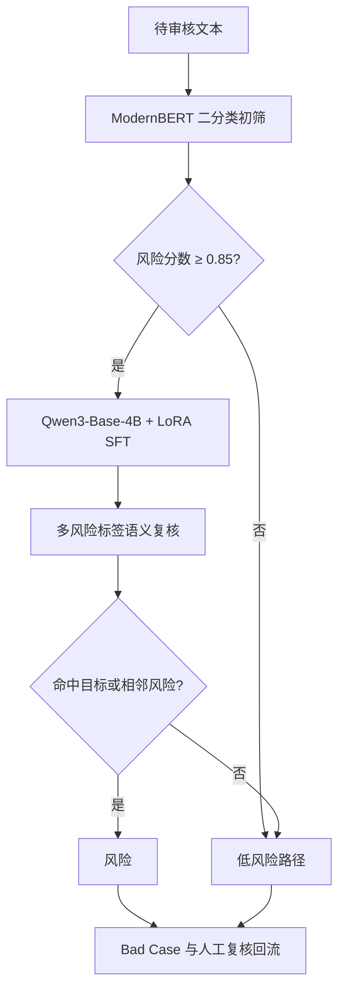

# 新标签能力冷启动：ModernBERT 初筛 + Qwen3 大模型复核

面向现有审核模型无法识别新增“低俗不良导向”风险的问题，构建轻量模型高召回初筛与大模型语义复核相结合的级联审核流程。项目覆盖标签边界定义、数据标注、ModernBERT 数据构建、Qwen3 SFT、Prompt 约束、阈值选择、离线回归和 Bad Case 回流。

> 本目录是公开安全版。原始文本包含真实业务内容、联系方式、会话标识和高敏审核样本，未被复制到 GitHub。示例均为合成文本。

## 1. 任务背景

新增风险标签冷启动通常存在三个矛盾：

1. 已上线模型没有见过新标签，直接复用会产生大量漏检；
2. 纯大模型全量审核成本和时延较高；
3. 新标签与相邻风险标签、正常内容的边界相似，单纯关键词规则容易误伤。

本项目中的目标风险聚焦于住房、合租、借住等语境中，将正常居住关系异化为带有暧昧陪伴、身体交换或不当条件的内容。难点在于：相同的“合租、限某性别、免费入住”等词语在不同上下文中可能是正常描述，也可能构成风险，必须结合条件关系和语义意图判断。

## 2. 解决方案



### ModernBERT 初筛

- 将任务简化为 `000=未命中`、`102=候选风险` 的二分类；
- 优先保障风险召回，将高分候选送入大模型；
- 当前实验阈值为 0.85，实际部署应根据成本、召回和误伤曲线重新标定；
- 轻量模型承担大流量过滤，降低大模型调用比例。

### Qwen3 大模型复核

- 通过 LoRA SFT 学习新增标签及相邻色情敏感类标签边界；
- Prompt 明确正常合租与附带不当交换条件之间的差异；
- 输出限制为单一标签，避免续写解释影响下游解析；
- 对 ModernBERT 候选进行更细粒度的上下文语义判断。

## 3. 数据规模

### ModernBERT 训练与验证数据

| 数据集 | 未命中 `000` | 候选风险 `102` | 合计 |
| --- | ---: | ---: | ---: |
| Train | 28,706 | 15,447 | 44,153 |
| Validation | 3,197 | 1,617 | 4,814 |
| **合计** | **31,903** | **17,064** | **48,967** |

### 独立评测集

| 切片 | 数量 |
| --- | ---: |
| 黑样本 | 1,669 |
| 白样本 | 1,167 |
| **合计** | **2,836** |

训练/测试文本文件进一步划分为 2,636 条训练样本和 200 条留出样本。公开资料只保留数量统计，不分发真实文本。

### 大模型 SFT 数据

大模型 SFT 文件共 3,251 条：

| 标签组 | 数量 |
| --- | ---: |
| 无风险 | 2,022 |
| 风险标签合计 | 1,229 |
| **总计** | **3,251** |

风险样本覆盖目标标签以及低俗擦边、低俗谩骂、色情描写、招嫖卖淫、约炮交友、色情资源等相邻标签，用于帮助模型学习审核边界，而不是把所有疑似表达都压缩为一个类别。

## 4. 数据构建流程

1. 从已授权的标注数据中抽取文本和人工结论；
2. 统一 `是/否`、风险标签和模型二分类编码；
3. 清理空值、乱码、接口响应 JSON、重复样本和无有效文本记录；
4. 删除手机号、邮箱、会话 ID、内部链接等直接或间接标识；
5. 按标签分层切分 Train/Validation/Test，保持可复现随机种子；
6. 为 ModernBERT 生成 `instruction/output` 二分类数据；
7. 为 Qwen3 生成“风险规则 + 待审核文本 → 单标签”的 SFT 数据；
8. 对训练和评测数据执行精确哈希去重与交集检查；
9. 评测总体准确率、风险召回、白样本误伤和大模型路由覆盖率；
10. 将误判样本按边界类型回流，继续补充难正例和难负例。

## 5. 遇到的问题与解决方式

| 问题 | 表现 | 解决方案 |
| --- | --- | --- |
| 新标签无历史能力 | 旧模型总体准确率约 76% | 新增目标标签数据，重新训练 ModernBERT 并对候选进行大模型复核 |
| 正常与风险语句词面接近 | 正常合租广告包含相同关键词 | 引入上下文条件、交换关系和真实意图作为 Prompt 边界 |
| 白样本误伤高 | 初始白样本准确率仅 60.15% | 补充容易被关键词命中的难负例并进行分层回归 |
| 风险类别长尾 | 部分细分类样本只有个位数或几十条 | 使用大模型多标签 SFT 共享语义能力，并持续定向补样 |
| 模型输出续写 | 标签后继续生成解释 | 使用封闭标签集合、低生成长度和严格首标签解析 |
| 阈值固定不适配线上分布 | 召回、误伤与调用成本失衡 | 输出阈值曲线，按业务目标选择 ModernBERT 路由阈值 |
| 原始数据存在个人信息 | 文本中可能含手机号、账号与会话 ID | 发布前执行规则脱敏、敏感信息扫描并只公开合成样本 |

## 6. 效果

### ModernBERT 回归

| 指标 | 优化前/线上分布 | 优化后离线回归 |
| --- | ---: | ---: |
| 黑样本准确率 | 87.48%（1,460/1,669） | 99.58%（1,662/1,669） |
| 白样本准确率 | 60.15%（702/1,167） | 97.94%（1,143/1,167） |
| 总体准确率 | **76.23%（2,162/2,836）** | **98.91%（2,805/2,836）** |

### 全链路

- 风险召回率：99.3%；
- 当前目录内可核验的离线误伤率记录：5%；
- 阈值：0.85。

“误伤率低于 2%”属于后续/其他口径，当前提供的文件中没有对应评测明细，因此公开版不将其写成已验证结论。

## 7. 公开脚本

- `scripts/sanitize_and_split.py`：对授权 TSV 执行基础 PII 脱敏、去重和分层切分；
- `scripts/evaluate_cascade.py`：复现“ModernBERT 分数阈值 → 大模型复核”的级联指标；
- `tests/test_pipeline.py`：使用合成数据验证脱敏、切分和级联评测。

## 8. 快速开始

脚本仅依赖 Python 标准库：

```bash
python scripts/sanitize_and_split.py \
  examples/synthetic_labeled.tsv \
  --train-output outputs/train.jsonl \
  --valid-output outputs/valid.jsonl \
  --valid-rate 0.25 \
  --seed 42

python scripts/evaluate_cascade.py \
  examples/synthetic_predictions.jsonl \
  --threshold 0.85

python -m unittest discover -s tests -v
```

## 9. 限制与后续工作

- 当前评测规模有限，应增加跨时间、跨场景和对抗表达测试；
- 阈值 0.85 不能直接迁移到其他部署环境；
- 应同时报告路由覆盖率、P95 时延与单条审核成本；
- 大模型标签边界仍需要人工复核和持续 Bad Case 回流；
- 原始数据在获得明确公开授权前只能保存在受控环境。
