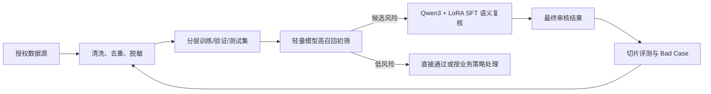

# 内容安全大模型微调与级联审核算法优化

**Qwen3-Base-4B + LoRA SFT / ModernBERT / TextCNN**

面向内容审核中的跨场景字段差异、新标签冷启动和存量标签持续优化，构建“轻量模型高召回初筛 → 大模型语义复核 → Bad Case 回流”的数据与算法闭环。本仓库为公开安全版，只包含方法、统计、脱敏脚本、配置和合成样本，不分发真实审核日志或生产模型。

## 项目导航

| 子项目 | 主要问题 | 技术方案 | 可核验结果 |
| --- | --- | --- | --- |
| [General non-review fine-tuning](General%20non-review%20fine-tuning/README.md) | 人工复核量大、不同场景字段结构不统一 | Qwen3-Base-4B + LoRA SFT；逐字段判断 + OR 聚合 | 10 万条黑白均衡 SFT 数据；项目总结口径为黑样本召回率 94%，提升 4pp |
| [New label cold start](New%20label%20cold%20start/README.md) | 新风险标签缺少识别能力、单模型难兼顾召回和误伤 | ModernBERT 初筛 + Qwen3 大模型复核 | 2,836 条评测集；准确率 76.23% → 98.91%；全链路召回率 99.3% |
| [Existing label optimization](Existing%20label%20optimization/README.md) | 存量标签分布漂移与房产场景辱骂/不友好漏检 | TextCNN 初筛 + Qwen3 大模型复核 + Bad Case 定向回流 | 98,144 条 TextCNN 训练样本；24,532 条 Qwen SFT 数据；召回率 72.7% → 87.3%；误伤率 0.2% |

## 统一技术链路

## 公开边界

- 公开：项目文档、数据卡、配置示例、标准库脚本、合成样本和测试。
- 不公开：用户文本、手机号、会话 ID、内部接口、模型权重、完整训练集、Excel 标注文件和原 Git 历史。
- 指标仅代表对应离线/切片数据集，不等同于无条件线上效果。
